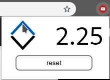

# Youtube Playback Speed

YPS is a chrome extension that allows the user to change the blayback rate of videos (works also with audio elements) to go above the usual limit (which is 2). It works on youtube, facebook and all social media and beyond.

