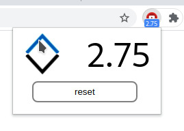

# Video/Audio Playback Rate (VAPRate)

VAPRate can change the playback rate of online audio/video elements and make it consistent across your tabs and windows. It can go above the usual limit which is 2x. It works on most websites including Youtube, Facebook, Twitter.

### Keyboard Shortcuts

- `Ctrl + Arrow up`: increase rate
- `Ctrl + Arrow down`: decrease rate

